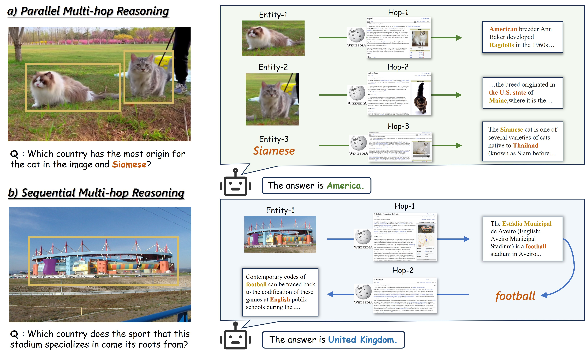
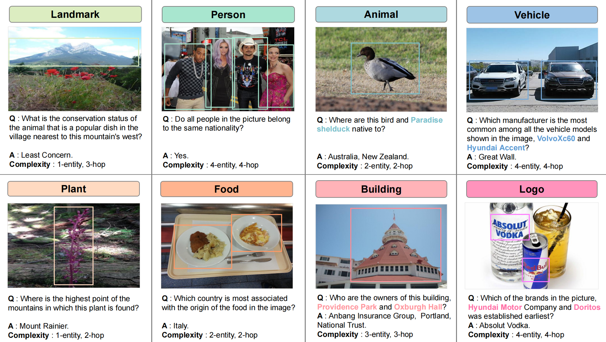

# M<sup>3</sup>-VQA

This is the official repository for the paper "M<sup>3</sup>-VQA: A Benchmark for Multimodal, Multi-Entity, Multi-Hop Visual Question Answering" (ACL2026main).

[[Paper]]() [[Code]]() [[Dataset]]()


<p align="center">
     <br>
</p>

<p align="center">
     <br>
</p>


## 💡 Introduction
We introduce M<sup>3</sup>-VQA, a novel and challenging benchmark designed to significantly advance the evaluation of knowledge-based Visual Question Answering. M<sup>3</sup>-VQA specifically targets the model's capability in fine-grained, multimodal entity understanding and sophisticated multi-hop reasoning.

## ✨ Highlights
Our benchmark introduces three key features:
- **Diverse Multi-Entity Questions**: M<sup>3</sup>-VQA incorporates a variety of fine-grained named entities—including architectural landmarks, individual person names, brands, and animal species—sourced from both visual scenes and textual information. Each question in the dataset involves multiple distinct entities, closely reflecting realistic multimodal interactions.

- **Complex Multi-Hop Reasoning**: Questions in M<sup>3</sup>-VQA require models to retrieve and integrate information from multiple documents or external knowledge sources, promoting extensive cross-modal and cross-document reasoning rather than reliance on single-step inference. Crucially, the dataset encompasses both parallel reasoning tasks—where multiple entities are independently analyzed before synthesizing an answer—and sequential reasoning tasks—where entities form a chain that models must sequentially traverse to reach the solution.

- **Traceable Supporting Evidence**: Each reasoning step in M<sup>3</sup>-VQA is explicitly supported by detailed, grounded evidence, allowing transparent traceability of model reasoning processes. Additionally, we provide a carefully curated multimodal knowledge base to support retrieval-augmented evaluation protocol.

This comprehensive design enables rigorous evaluation of MLLMs, both in standalone settings and scenarios enhanced by retrieval mechanisms, effectively pushing the boundaries of real-world multimodal understanding and reasoning.

## 📊 Main Results
We evaluate 16 leading MLLMs under three settings: without evidence, with gold evidence, and with retrieval from an external knowledge base. Our experiments reveal the following key findings:

- **MLLMs Perform Poorly without External Knowledge**: When restricted to only the image and question, models consistently underperform, with a maximum accuracy of 32.6\%. This reveals a fundamental limitation of current MLLMs in acquiring and applying background knowledge solely from their internal representations.

- **Precise Evidence Significantly Boosts Reasoning Accuracy**: When gold supporting evidence is provided, model performance improves substantially. This indicates that even advanced MLLMs remain heavily reliant on well-structured external information to support complex multi-entity reasoning.

- **Reasoning-Aware Agentic Retrieval Outperforms Heuristic Approach**: While retrieval-augmented approaches boost performance, we find that agentic retrieval—featuring explicit reasoning and iterative planning—outperforms heuristic retrieval. This underscores the importance of structured reasoning strategies in tackling multi-entity, multi-hop questions.


## 🚀 Get Started


### M<sup>3</sup>-VQA Dataset
The VQA questions and images can be downloaded here:

*   [Dataset]()

The fields are:

* **data_id**: A unique identifier for this data sample.

* **image_id**: The filename of the image associated with the question.

* **question**: The natural language question being asked about the image and related knowledge.

* **question_type**: A code representing the complexity of the question.

* **question_hop**: The number of reasoning steps (hops) required to answer the question.

* **entity_num**: The number of key entities involved in the question.

* **answers**: A list of correct answers to the question.

* **answer_evals**: Accepted answer variations or evaluation forms used to check correctness.

* **img_entity_names**: The main entities  identified in the image.

* **evidence**: Supporting text passages used to derive the answer.

* **evidence_urls**: Source URLs from which the evidence text is taken.

* **evidence_img_ids**: Image IDs corresponding to the evidence (null if not applicable).

* **evidence_section_ids**: Indices indicating which sections of the wikipedia pages the evidence comes from.

* **evidence_section_titles**: Titles of the sections in the wikipedia pages where the evidence is found.

* **evidence_url_titles**: Titles of the wikipedia pages referenced in the evidence URLs.

### Controlled Knowledge Base
Our knowledge base is based on EVQA's, which can be downloaded here:
*   [Knowledge base](https://github.com/google-research/google-research/tree/master/encyclopedic_vqa#controlled-knowledge-base) 

### Evaluation Script
To run the evaluation script, you need to store the model’s prediction results in a JSONL file in the form of a list, for example:

```
{"data_id": "data_0043298", "predicted_answers": ["Australia", "New Zealand"], "answer_evals": [["au", "Australia", "Aussieland", "AU", "Commonwealth of Australia", "Oz", "🇦🇺", "Straya", "AUS"], ["nz", "Dominion of New Zealand", "🇳🇿", "New Zealand", "Aotearoa", "NZ", "Aotearoa New Zealand", "NZL"]], "question_hop": 2, "entity_num": 2}
```

Run evaluation on M<sup>3</sup>-VQA:

```python
python run_eval.py
```


## ❤️ Acknowledgement

We would like to thank the following open-source projects for their valuable contributions:

* [EVQA](https://github.com/google-research/google-research/tree/master/encyclopedic_vqa)
* [INFOSEEK](https://github.com/edchengg/infoseek_eval)


## 📑 Citation
If you find this work helpful, please cite using this BibTeX:
```

```

## ✉️ Contact

If you have any questions, please reach out to:

*   Jiatong Ma - majiatong2025@ia.ac.cn
